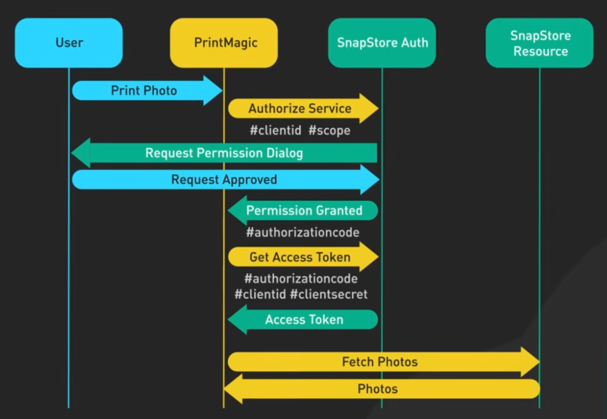
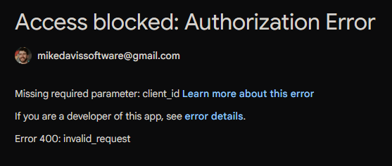
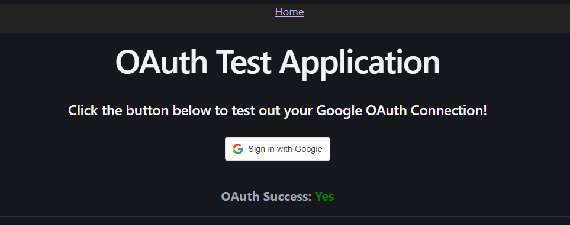

<link rel="stylesheet" href="./notes-style.css">

# OAuth Research Project

### TASK: Spend a half-day researching OAuth, taking notes throughout this research process

<hr/>

## _0:00 - 0:45_ - Overview_

I will begin with my initial idea of what OAuth is, so that I can compare & contrast that to my updated understanding of the technology.

As indicated by the name, OAuth is a streamlined tool for authorizing access to data that is already accessible to another account. This process assumes the precondition of authentication of this other superaccount, which then allows the authorization of certain permissions to this subcontext in which OAuth is being used.

From what I know of authentication and authorization, I assume that this is all accomplished through key generation, where the subcontext’s client sends a request for a set of permissions to access data, using the superaccount’s authentication to trigger the key generation. I would also assume that this creates a sort of session within the subcontext that can be terminated by the client or the superaccount at any time, most likely by the removal of the generated key from the superaccount’s set of active keys.

More broadly, I know that OAuth (specifically OAuth 2.0) is widely used by major tech companies like Google and Meta, to quickly authorize access to user data across a plethora of different applications. These applications include but are not limited to phone apps, web apps, and desktop apps.

The use of OAuth allows for quick access to essential data like name, email address, or media files, so that the account creation or login process is extremely easy and users are not discouraged by the inconvenience of filling in account creation forms. It also eliminates the possibility of typos in that process, and also can circumvent the inconvenience of email confirmation. Both of these conveniences save the user time and boost the rate of signups for any app that chooses to use OAuth.

Lastly, I’d like to quickly address the privacy issues around OAuth. In an age of user data being so valuable, OAuth directly gives providers a strong picture of which sites users visit and which apps they use. With the high level of distrust of tech companies, this is definitely something to consider when choosing to incorporate OAuth into any application. Though I think the actual information being shared by providers is secure, their ability to monitor which applications users are creating accounts on could be a growing cause for concern in certain users, moving forward.

<hr/>

## _0:45 - 2:15_ - Research Phase_

With my overview out of the way, I had developed a great framework for different branches of exploration to confirm or deny what I know and to gain a deeper understanding of how OAuth works.

I began my research by creating a GitHub repository, which served as a central location for all my notes and codebase when testing out the technology myself.

___NOTE:__ I want to be transparent that I lean on Google AI when researching development technologies. I have found it very useful to streamline the research process and point me in the right direction towards applicable documentation, articles, community forums, videos, etc._ 

I began by creating a bulleted list of questions inspired by my overview:

- What is OAuth, generally?
- What are the practical benefits and drawbacks of using OAuth?
- How does OAuth achieve authorization?
- How does OAuth manage tokens?
- How is security implemented in OAuth?
- How do I integrate OAuth into my application?
- Are there any good reasons not to use OAuth?

This felt like a great starting point for me to run through roughly in order.

### What is OAuth?

Generally, OAuth is like a special key to access certain information stored by a user account, without having to share the login credentials for that account.

There are three entities in a simple OAuth interaction:

- **Client**: The application requesting access to the user's data.
- **Resource Owner**: The user whose data is being accessed.
- **Authorization Server**: The server that manages the authorization process.

Using an example where the <span class="user">User</span> _(Resource Owner)_ wants to authorize <span class="print-magic">Print Magic</span> _(Client)_ to print photos stored in their <span class="snap-store">SnapStore</span> _(Authorization Server)_ account, here is a diagram depicting the process: (Order of events is top-down)



Image Source: [OAuth 2 Explained In Simple Terms](https://www.youtube.com/watch?v=ZV5yTm4pT8g&t=13s)

The general steps are as follows:

1. <span class="user">User</span> sends print job request to <span class="print-magic">Print Magic</span>.
2. <span class="print-magic">Print Magic</span> sends authorization request <span class="snap-store">SnapStore Auth</span>, accompanied by _client ID_ and _scope of permissions_.
3. <span class="snap-store">SnapStore Auth</span> sends permission request dialog to <span class="user">User</span>.
4. <span class="user">User</span> sends approval to <span class="snap-store">SnapStore Auth</span>.
5. <span class="snap-store">SnapStore Auth</span> grants permission to <span class="print-magic">Print Magic</span>, via an _authorization code_.
6. <span class="print-magic">Print Magic</span> sends request for _access token_ to <span class="snap-store">SnapStore Auth</span>, accompanied by the _authorization code_, _client ID_, and _client secret_.
7. <span class="snap-store">SnapStore Auth</span> sends _access token_ to <span class="print-magic">Print Magic</span>.
8. <span class="print-magic">Print Magic</span> sends fetch request for photos to <span class="snap-store">SnapStore Resource</span>.
9. <span class="snap-store">SnapStore Resource</span> sends photos to <span class="print-magic">Print Magic</span>.
10. <span class="print-magic">Print Magic</span> now has the photos, and can fulfill the originally requests print job for <span class="user">User</span>.

#### In a Nutshell:
OAuth empowers <span class="user">User</span> to permit <span class="print-magic">Print Magic</span> to access certain resources from <span class="snap-store">SnapStore Resource</span>.

For an added layer of security, OAuth can set __access tokens__ to expire as well. OAuth can also provide __refresh tokens__ to the client, which is useful for maintaining user sessions and ensuring that the client has the latest permissions.

#### Questions still left to answer:
- What are the practical benefits and drawbacks of using OAuth?
- How does OAuth achieve authorization?
- How does OAuth manage tokens?
- How is security implemented in OAuth?
- How do I integrate OAuth into my application?
- Are there any good reasons not to use OAuth?

<hr/>

## _2:15 - 4:00_ - Testing OAuth in Local Application

After having gotten the general information flow of OAuth in a real-world situation, I felt like I understood the big picture. As someone who finds it most efficient to learn by _doing_, I decided to spend the rest of my time setting up OAuth in a local application.

The first thing I needed was a Client ID from a chosen provider. As someone generally familiar with Google products and the owner of many Google accounts, I chose Google for my OAuth provider. This meant that I had to navigate to Google Cloud Console to create an OAuth client ID credential. Since I planned on using Vite, I knew I should add Vite's default "http://localhost:5173" to Authorized JS origins and redirect URIs. After generating the Client ID information, I set this aside for later use. Here is the Client ID JSON object:

```JSON
{
  "web": {
    "client_id": "250221579461-l2roi24d7n7ojq333b2jede2k9744m19.apps.googleusercontent.com",
    "project_id": "oauth-test-app-510503",
    "auth_uri": "https://accounts.google.com/o/oauth2/auth",
    "token_uri": "https://oauth2.googleapis.com/token",
    "auth_provider_x509_cert_url": "https://www.googleapis.com/oauth2/v1/certs",
    "client_secret": "NOT_SHOWN_HERE",
    "redirect_uris": [
      "http://localhost:5173"
    ],
    "javascript_origins": [
      "http://localhost:5173"
    ]
  }
}
```

Using Vite for my development environment, I scaffolded a new project using TypeScript and React. I then took the template home page for Vite and replaced the content with a simple state-dependent success message, as well as a button to trigger the OAuth. The project is located in [this folder](./oauth-practice/).

Next up, I had to install the OAuth React package for Google:

```bash
npm install @react-oauth/google
```

Next, it was time to read some documentation and identify the imports I needed to do a basic test of OAuth with my simple button app. I found out that I had to import a provider container `GoogleOAuthProvider` as well as the actual login component `GoogleLogin`, like so:

```JavaScript
import { GoogleOAuthProvider, GoogleLogin } from '@react-oauth/google';
```

After building the provider and login button into my app, I tested it before adding the Client ID, just to see what happens. As usual, the OAuth button opened a small pop-up window where the user would normally click which available account they would like to use for this session. Having purposely excluded the Client ID, here was what I saw:



After placing my Client ID in the provider, I got a successful login and was able to select the account I wanted to use for this session, see the list of information that would be shared to the client, and finally see the success both in the state-controlled indicator of success on my application.



Next up, I was curious to see the actual token that was returned from the successful authorization. I moved my `setSuccess()` logic into individual `handleSuccess` and `handleFailure` functions, to keep the JSX clean and allow for these functionalities to scale up as needed. This is what I put into `handleSuccess` to show the token in the console:

```JS
const handleSuccess = (credentialResponse) => {
  setSuccess(true); // success is a Boolean state variable for this example
  console.log(credentialResponse.credential) // This was a very long obfuscated string
}
```

Once I was able to acquire my token, I wanted to be able to see the user information on my local machine without having to build a back end just yet. In my search, I found that `jwt-decode` was the package I needed to do this. So, I installed it using npm:

```bash
npm install jwt-decode
```

With this decoding tool now available to set the decoded object as the current user, and extract data such as email address. It is important to note that the JWT ID is not encrypted, but rather obfuscated. This is why a simple NPM package can decode it in any context.

I finished my testing session by: 
- Creating a `user` state variable
- Removing the unnecessary Boolean `success` variable from component logic
- Updating my `handleSuccess` function
- Rendering the user email in the application to show that the expected information was fetched and decoded correctly

<hr/>

## Final Thoughts

Though I now have many more questions about how OAuth works behind the scenes, I now have a working understanding of how to implement it in a front end application. I can also easily see how OAuth could be used directly by an application's back end, possibly attaching the OAuth credentials to a client device's user session.

As someone who wants to use OAuth in my own future applications, I am glad that I now have this repository as a place to continue exploring the topic. Great exercise!